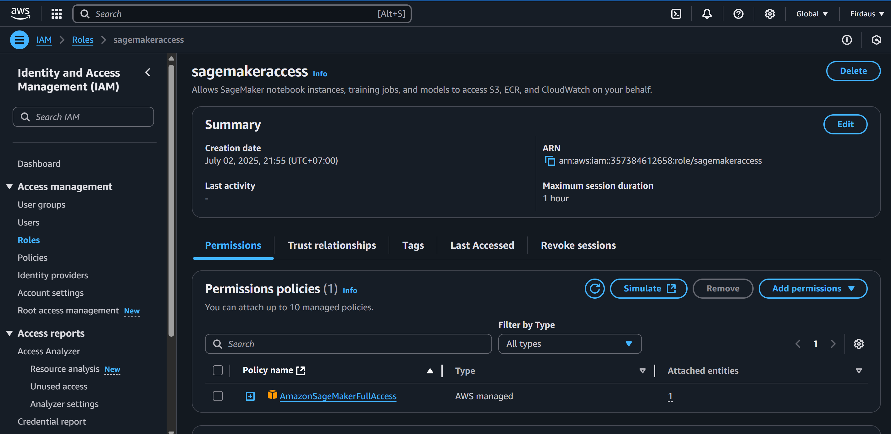
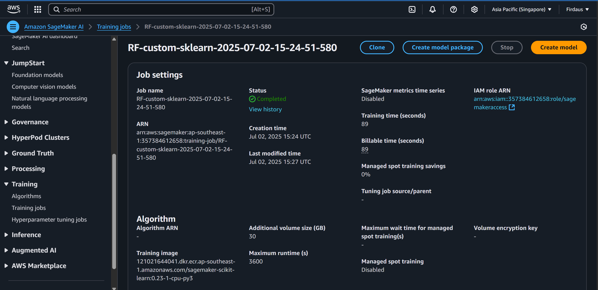
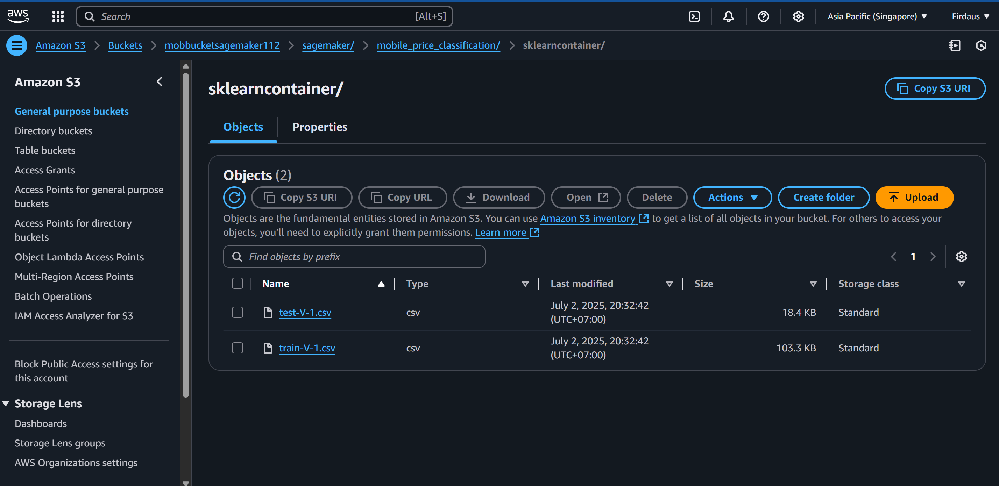
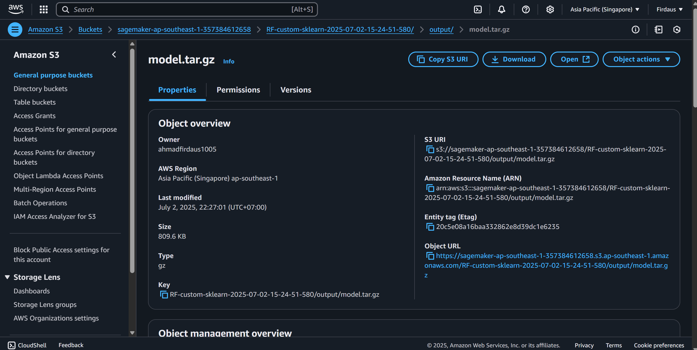
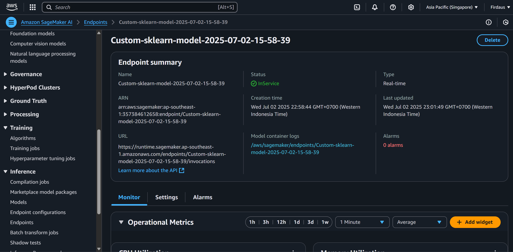

# 📦 Mobile Price Classification using AWS SageMaker

This project demonstrates a complete **end-to-end machine learning pipeline** to train, deploy, and host a classification model using **Amazon SageMaker**. The goal is to classify mobile phone prices based on various features using a Random Forest Classifier.

## 👨‍💻 Role

As the Data Scientist of this project, I handled:
- Data preprocessing and splitting
- Model development using Scikit-learn
- SageMaker training job orchestration
- Model deployment via SageMaker endpoint
- Integration with AWS services such as S3 and IAM

## 🧱 Project Structure

ml_awssagemaker/
├── assets/ # Images or visual materials for README
├── mob_price_classification_train.csv # Raw dataset
├── train-V-1.csv # Training data after split
├── test-V-1.csv # Testing data after split
├── research.ipynb # Notebook for preparing data and triggering SageMaker job
├── script.py # Script used by SageMaker to train the model
├── requirements.txt # Python dependencies
├── README.md # Project overview (this file)
└── venv/ # Virtual environment (ignored in .gitignore)

---

## 🛠️ Tools and Technologies

- **Amazon SageMaker**: Model training, deployment, and endpoint hosting  
- **Amazon S3**: Storing training/testing data and trained model artifacts  
- **IAM**: Role-based access to SageMaker and S3  
- **Python 3.10**  
- **Scikit-learn**: RandomForestClassifier  
- **Pandas, NumPy**: Data processing  
- **Jupyter Notebook**: Experimentation and orchestration

---

## 🚀 Workflow Overview

1. Load and preprocess the dataset in `research.ipynb`
2. Split into train/test sets and upload to S3
3. Configure SageMaker training job with custom `script.py`
4. Train Random Forest model inside SageMaker
5. Save the model to S3 as a `.joblib` artifact
6. Deploy the trained model to a live SageMaker endpoint

---

## 📊 Results

- **Model**: Random Forest Classifier  
- **Endpoint**: Deployed successfully on Amazon SageMaker

### Iam role

### IAWS Sagemaker AI Training Job

### Data Train and Test in S3 Bucket

### Model Output in S3 Bucket

### End-Point Deployment of ML in AWS Sagemaker

